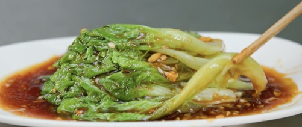

# 蚝油生菜的做法

## 必备原料和工具

- 生菜（3颗大概600g）
- 清水（适量）

## 计算

配菜：

- 大蒜（3粒）

调味料：

- 蚝油（约10g）
- 生抽酱油（约5g）
- 老抽（少许）
- 白糖（一勺，约2g）
- 味精（少许，约0.5g）
- 食用盐（少许，约0.5g）

## 操作

1. 将生菜叶子摘下来清洗，捞出沥干水分备用，将大蒜切碎备用
2. 盆中放入适量清水，将调味料依次放入，搅拌均匀备用
3. 锅中加入适量清水，大火烧开之后加入食用盐一勺（约3g），加入少许植物油保色，加入清洗干净的生菜焯水至断生（9成熟），水再次烧开之后将生菜倒出沥干水分，然后将其摆盘
4. 将事先调好的料汁倒入锅中，小火将料汁烧开，烧开之后将锅离火，加入少许土豆淀粉收汁，汁水收浓之后加入蒜蓉之后煮15s至断生，最后加入少许明油即可出锅
5. 将蚝油汁均匀淋在生菜上面即可

如果您遵循本指南的制作流程而发现有问题或可以改进的流程，请提出 Issue 或 Pull request 。
