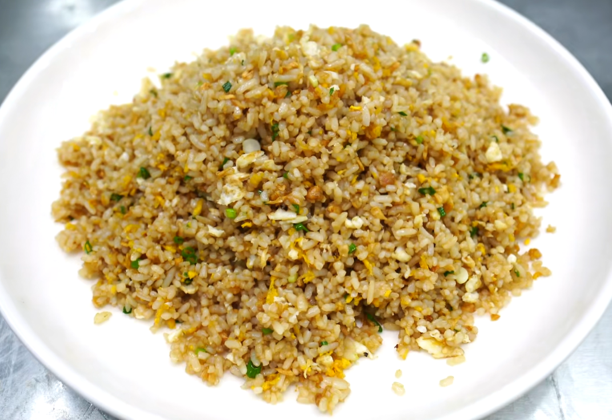

# 酱油炒饭的做法

## 必备原料和工具

- 冷米饭（适量，最好隔夜饭）
- 鸡蛋（3个）

## 计算

配菜：

- 萝卜干（几根）
- 干淀粉（少许）
- 小葱（几根）
- 植物油（适量）

调味料：

- 食用盐（少许）
- 生抽酱油（10克）

## 操作

1. 将冷米饭捏散备用，在米饭中加入少许干淀粉搅拌均匀，吸收多余的水分
2. 准备几根萝卜干泡入水中十分钟捞出挤干水分（也可以用榨菜代替），将其剁碎备用，最好比米粒小
3. 鸡蛋3个将蛋白和蛋黄分开（嫌麻烦可以省略这一步）
4. 小葱切成葱花备用
5. 把锅烧热，加如适量的油，将蛋白下锅，转小火将蛋白煎香煎至定型，捞出备用，加底油烧热加入蛋黄煎香，煎香之后加入切好的萝卜干，快速翻炒几下，使蛋黄和萝卜干融合，再加入煎好的蛋白，多翻炒几下至能明显闻到香味时加入处理好的米饭，米饭下锅之后在锅边淋入少许的食用油翻炒（迅速使米饭升温），当米饭能够在锅中跳动的时候再加入生抽酱油10克从锅边淋入，然后再加入少许食用油从锅边淋入，开中大火翻炒一分钟，翻炒一分钟后再加入切好的从化翻炒均匀即可出锅。

## 技术总结

- 隔夜米饭最好加入少许的食用盐保鲜
- 萝卜干是炒饭的百搭材料，任何形式下都可以加入
- 由于只加入酱油调味所以必须控制油量和锅里面的温度，这样才能做出一份干香适口的酱油炒饭

如果您遵循本指南的制作流程而发现有问题或可以改进的流程，请提出 Issue 或 Pull request 。
